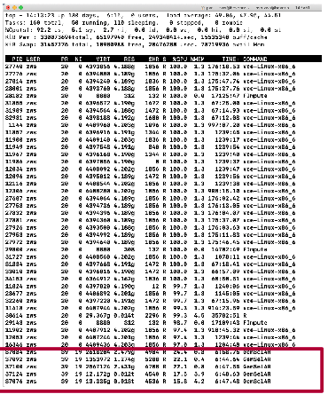

Priority and Niceness of Linux Processes
================

## Disclaimer

Some hints to assign different levels of priority to different jobs
running on the same linux machine. The facts shown here are mostly based
on
<https://askubuntu.com/questions/656771/process-niceness-vs-priority>.

## Background

There are different sources about process priorities on a linux system
and their relation to niceness and the program `nice`. Examples
    are

  - <https://en.wikipedia.org/wiki/Nice_(Unix)>
  - <https://www.howtogeek.com/411979/how-to-set-process-priorities-with-the-nice-and-renice-commands-in-linux/>
  - <https://www.thegeekdiary.com/unix-linux-how-to-change-the-niceness-priority-of-a-process/>

In summary, the user can use the program `nice` to assign a niceness
value (see Practical Example) when starting a process. One has to be
careful when starting different processes in parallel from inside a
script, because all the processes started from inside the master-script
would be required to start with a given `nice` command. In such a
scenario, perhaps the program `renice` is more suited. This lets you
re-assign a niceness value to a certain script.

It is important to remember that when looking at a top-output lower
values of priority (`PR`) and nice (`NI`) are associated with a higher
priority. The following relation holds between `PR` and `NI`:
\(PR = 20 + NI\).

An ordinary user (no sudoer rights) can only assign nice values between
\(0\) and \(19\). The negative values are reserved to admins. From the
experience below, ordinary users can only increase but not decrease nice
values.

## Practical Example

When starting several processes out of a master script and you wanted to
give them a lower nice value this can easily be done using the program
`renice`.

``` bash
./prog/runBayesCPi.sh work/gsRuns.txt.1
```

The above command starts a number of `GenSel` jobs. Using the `top`
output, we can see that the `GenSel` jobs are running with some other
jobs with all the same `NI` values.

<!-- -->

## Assign Different Priority

In case we want to assign a different `NI` value to all the `GenSel`
jobs, we can do this with the following statement.

``` bash
renice 19 -p $(pgrep GenSel4R)
```

This changes the top-output to the following

<!-- -->
